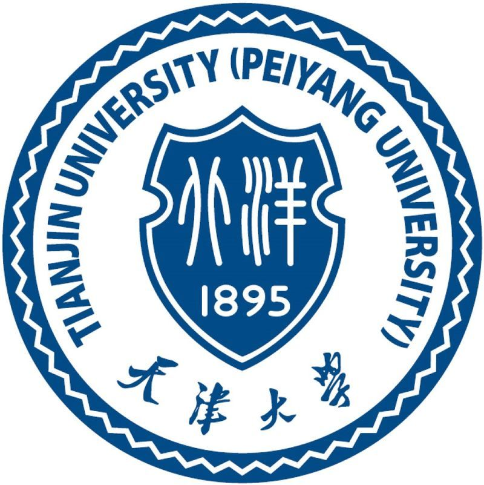
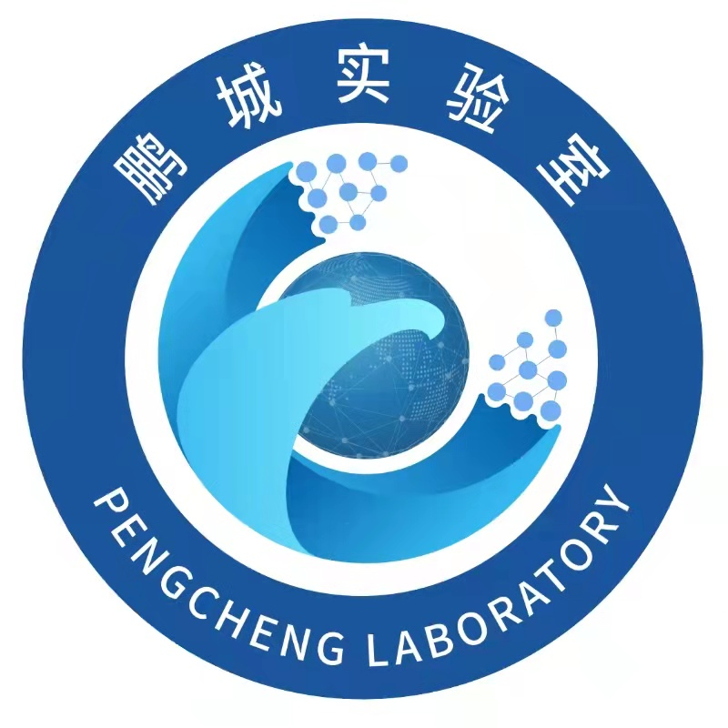

## About Me

I'm Zhilin Zhu (朱之林), a Ph.D. candidate in the VIR Group, Harbin Institute of Technology (HIT, Shenzhen), advised by [Prof. Xiaopeng Hong](https://homepage.hit.edu.cn/hongxiaopeng) and [Assoc. Prof. Zhiheng Ma](https://scholar.google.com/citations?user=y6ijVukAAAAJ&hl=en). I'm also a Co-culture Student at [Pengcheng Laboratory](https://www.pcl.ac.cn/). Before attending HITsz, I obtained my B.Sc. degree and M.Sc. degree from VisDrone Lab at Tianjin University (TJU), advised by [Prof. Pengfei Zhu](http://aiskyeye.com/) and [Assoc. Prof. Yu Wang](https://wangyutju.github.io/). 

## Research Interests

- **Machine Learning:** Continual Learning, Transfer learning, Few-shot learning
- **Multi-modal Learning:** Vison-language models, Open-vocabulary learning

## Education

        <strong> Harbin Institute of Technology, Shenzhen, China</strong>
           
        <ul>
        <li>School of Computer Science and Technology, Sep 2023 - Now </li>
        <li>
          Ph.D. candidate, Advisor: Prof. Xiaopeng Hong and Assoc. Prof. Zhiheng Ma</li>
      </ul>      
      

        <strong> Tianjin University, Tianjin, China</strong>
           
        <ul>
        <li>College of Intelligence and Computing, Sep 2016 - Mar 2023 </li>
        <li>
          Bachelor & Master, Advisor: Prof. Pengfei Zhu and Assoc. Prof. Yu Wang</li>
      </ul>      
      

## Experience

        <strong> Pengcheng Laboratory, Shenzhen, China  (Sep 2023 - Now) </strong>
          <a target="_blank" rel="external">
            
          </a> 
        <ul>
        <li>
          Co-culture Student </li>
        <li>
          In the Department of Networked Intelligence </li>
      </ul>      
      
   

        <strong> ByteDance, Beijing, China  (Apr 2022 - Jun 2022) </strong>
          <a target="_blank" rel="external">
            
          </a> 
        <ul>
        <li>
          Academic Intern </li>
        <li> In the Department of Risk Control  </li>
      </ul>      
      

      
## News

- **[2024-08]** Our paper about continual test-time adaptation (CTTA) has been accepted by European Conference on Computer Vision (ECCV).
- **[2023-06]** Our team (served as team leader) has won the runner-up of the 4th CLVision Challenge about Continual Learning in CVPR 2023.
- **[2022-11]** Our paper about few-shot learning and multi-granularity has been accepted by Pattern Recognition (PR).
  



